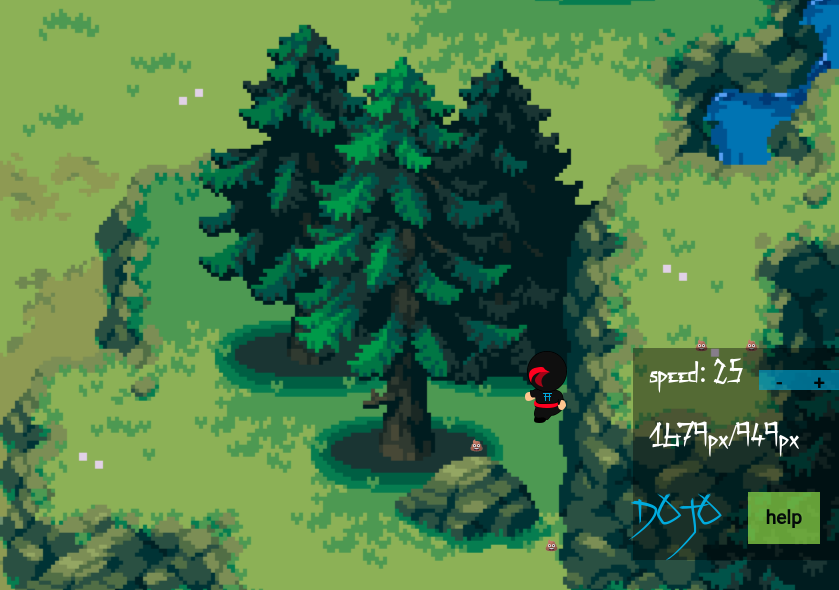

#  Ninja game
Coding DOJO bootcamp project, 2d platformer game

## Getting Started
To run this game you need to start it with live server. Move your ninja across your browser screen, explore the world, change his speed, cast teleport spell, shoot-shit.

## Controls
* move ⬆️/W 
* move ➡️/D
* move ⬇️/S 
* move ⬅️/A 
* increase speed 🐆 = click on + 
* decrease speed 🐌 = click on - 
* cast teleport 💥 = R 
* will shoot 💩/⭐ (depends on build) = E/Space 

## Features added
* added controls to W,D,S,A.
* added 2D background.
* imported font-face chineese style font - Zenzai.
* added small blue coding DOJO logo on ninja back.
* added teleport feature, teleport sound is played, and you can clearly see that ninja was teleported.
* added speed control feature.
* pop-up module with control instructions.
* accessibility, after 1250px width the game change background, and it will not run <850px and the player will be notfied.
* added colored debug console 

## Suported screen size 
* 2560pxx850px
* 1920pxx950px
* 1440pxx850px

## Author

* **IURII LYTVYN** 

## Music 
sawsquarenoise [Towel Defence OST]

## License

This project is licensed under the MIT License 

## Demo

